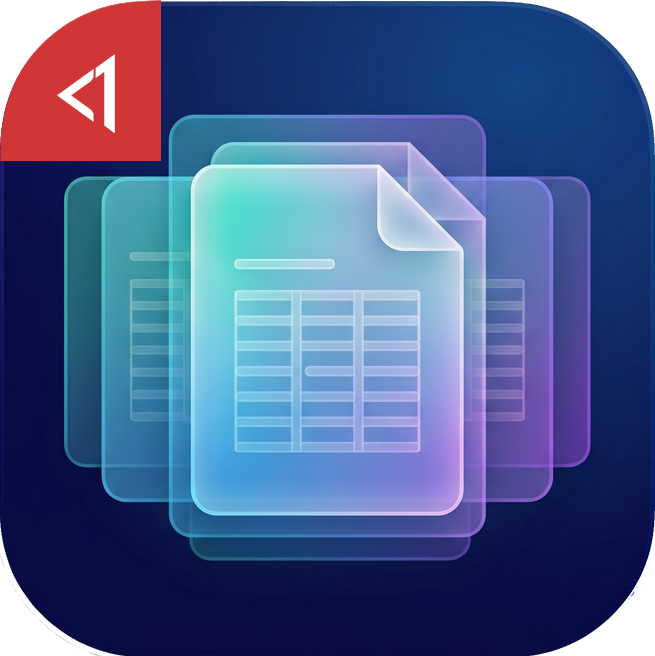

  

<h1 align="center">MithenPDF</h1>

MithenPDF is a lightweight multi-format (PDF, EPUB, MOBI, CBZ, CBR, FB2, CHM, XPS, DjVu) document reader for Windows. A Windows focused fork of <a href="https://github.com/sumatrapdfreader/sumatrapdf">SumatraPDF</a>.

## Additional features in this fork
* Follows the Windows Explorer sorting wherever files are listed: `Next File` / `Previous File` (`Ctrl + Shift + Right` / `Ctrl + Shift + Left`), the `Navigate Files in Folder` dialog, and the tab order when several files are opened from Explorer. Whatever column and direction is set there (Name, Date modified, Date created, Type, Size) is used.
* PDF forms: date fields open a month-calendar picker, and signature fields open a draw box for a freehand or image signature.
* Simplified menu bar: `File` / `View` / `Read Aloud` / `Settings` / `Help`, with Help limited to `About` and the GitHub page.
* Streamlined default hotkeys:
  * `Esc` exits, `Alt + Enter` / `Ctrl + F` / `F11` toggle fullscreen
  * `Ctrl + I` shows properties
* Removed favorites, "recently opened" tracking, and their settings.
* Removed the update checker and all AI integrations.
* Removed the Debug menu and the Manual (`F1`).
* Removed the language menu. Language is selected only during installation.
* Not registered as a handler for images, archives, `.md`, `.txt`, or PostScript; file navigation skips those extensions. They can still be opened when asked explicitly.
* Uninstalls cleanly, no leftovers.

## Supported platforms
* Windows 7, 8, 8.1, 10, 11 (x64). Some formats (CHM) need the Microsoft Edge WebView2 Runtime, which ships with Windows 11 and recent Windows 10.

## Part of MithenApps
* No telemetry
* No changing language after installation (lighter)
* No lingering background service. Closed when it's closed.
* No tracking of what "recent" files you opened. (lighter, privacy reasons)
* No update checking (use it as a tool, update it when you find issues only)
* Uninstalls cleanly, no leftovers
* Prioritizing user-ergonomics

## Credits
* [SumatraPDF](https://github.com/sumatrapdfreader/sumatrapdf) - the reader MithenPDF is based on; see `AUTHORS` for its authors.
